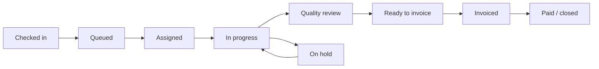

# Repair Order Workflow Redesign

Status: canonical workflow implemented; authorization/audit hardening remains on the roadmap
Scope: customer/truck intake, repair-order creation, live work building, technician workflow, customer communications, finalization, invoicing, and payment

## Executive decision

Adopt a **work-first repair order with final-price publication**.

The repair order must remain an editable operational record while the truck is in the shop. A quote must no longer be required to assign a technician or begin work. Customers should see operational progress, approved public notes, and public photos during the repair, but no live monetary amounts. Staff finalize the order only after work and pricing are complete; finalization creates an immutable financial snapshot and sends the invoice.

Keep estimates as an **optional authorization tool**, not as the repair-order state machine. Some jobs may still require a price approval, deposit, not-to-exceed amount, or change-order approval, but those controls should pause only the affected work—not every order in the shop.

The recommended lifecycle is:



Pricing remains editable from Checked in through Quality review. It locks in one atomic operation at Finalize & Send Invoice.

## Why the current workflow fails the shop

The implementation currently combines three different concepts in one status sequence:

1. Shop operations: checked in, assigned, working, review, complete.
2. Customer authorization: estimate sent, approved, declined.
3. Finance: invoice sent, paid.

That creates several structural problems:

- A quote draft is automatically created after a new repair order, even when the shop only intends to open a work record.
- Customer repair orders allow price-builder edits only in `draft` or `quoted`.
- First technician assignment and admin start-without-technician both require `approved`.
- Quote approval therefore freezes the amount before real work and diagnosis are complete.
- The drawer's primary visual hierarchy is `Draft -> Send -> Approved -> Technician`, so operators are guided toward the wrong gate.
- The customer portal displays the live order total on active repairs, exposing a number the shop does not consider final.
- The invoice is created after completion, but invoice PDFs and emails read the repair order's line items. The system should explicitly snapshot those lines at finalization instead of relying only on edit locks.

This is not mainly a drawer-layout problem. The status model, API authorization rules, customer projections, notifications, and financial snapshot behavior all need to change together.

## Current workflow map

### Intake and order creation

- Staff can select an existing customer and truck or create both inline.
- Truck selection resolves ownership back to a customer, which is useful and should remain.
- Staff can add common services and a complaint/description during creation.
- Selected services are applied sequentially to the price builder after the repair order is created.
- The frontend then automatically creates a quote draft.
- The operator is dropped into the price-builder drawer.

### Work building and authorization

- Staff adds operations, saved labor, parts, discounts, notes, and photos.
- Customer orders are price-editable only while `draft` or `quoted`.
- Sending a quote records a pricing lock marker, although quoted revisions are specially allowed until approval.
- Customer approval changes the repair order to `approved` and makes pricing non-editable.

### Assignment and work

- First technician assignment requires `approved` for customer work.
- The admin override to start without an assigned technician also requires `approved`.
- Technician acknowledge/start changes the order to `in_progress`, starts time tracking, and sends a no-price “work started” email/SMS. This notification is already close to the desired customer experience.
- Holds are represented as a sub-state of `in_progress` and include waiting for parts, customer approval, or more information.
- Technician completion moves to `pending_review`; manager approval moves to `completed`.

### Completion and finance

- Manager approval sends a completion/pickup notification.
- The backend then attempts to auto-create and email an invoice.
- Invoice/payment states continue as `invoiced` and `paid` on the repair-order status itself.

### Customer experience

- A sent quote is presented as Action Required and exposes the estimate total.
- Active repairs show operational status, photos, description, and the current repair-order total.
- This means mutable internal pricing is currently customer-visible during active work.

## Target operating model

### 1. Fast intake: identify the truck first

The default path should optimize for a truck already at the counter or in the yard:

1. Search one field by unit number, VIN, license plate, customer/company, or phone.
2. Select an existing truck; its customer profile fills automatically.
3. If not found, create the customer and truck inline without leaving intake.
4. Capture mileage-in, complaint/work requested, initial photos, PO number, and authorization policy.
5. Select `Create & check in`.

Do not ask staff to price the job or create a quote during intake. Common services can still be quick-added, but they should populate the live work record, not create an estimate.

Customer/truck data should remain canonical:

- One customer/company can own many trucks and contacts.
- A truck has one current owner but keeps service history across ownership changes if that becomes supported.
- Duplicate detection should use normalized VIN first, then unit + customer, then license plate.
- The order stores snapshot display fields for audit/history, while foreign keys still point to the canonical customer and truck.

### 2. Separate staff workspace from customer projection

Rename the drawer conceptually from **Price Builder** to **Repair Order Workspace** or **Job Workspace**.

Staff view:

- Complaint and diagnosis
- Operations and labor
- Parts and sublets
- Discounts and internal pricing
- Technician assignment and timer state
- Internal notes versus customer-visible updates
- Photos marked Internal or Customer-visible
- Holds and requested decisions
- Live internal totals
- Finalization checklist

Customer view before invoicing:

- Truck and repair-order number
- Checked in / queued / in bay / work in progress / quality check / ready
- Last updated time
- Customer-visible notes and photos
- “No action needed” or a specific authorization request
- Shop contact information
- No parts prices, labor prices, discounts, savings, subtotal, or running total

Customer view after invoicing:

- Final itemized invoice and total
- Payment methods and due date
- Final customer-visible photos/notes
- Service history entry

### 3. Make authorization independent of workflow status

Add an authorization policy to each repair order:

- `shop_account`: work may proceed under an existing fleet/shop agreement.
- `verbal`: staff recorded verbal authorization with actor, timestamp, and note.
- `written_no_price`: customer authorized diagnosis/repair without a published amount.
- `not_to_exceed`: work may proceed up to a customer-approved ceiling.
- `estimate_required`: specified work or the whole job requires estimate approval.
- `admin_override`: manager explicitly permitted work to proceed; reason required.

An authorization record should capture who authorized, channel, timestamp, scope, optional maximum amount, attachments/signature, and staff witness. This provides an audit trail without forcing every job through an early fixed-price estimate. Exact language and requirements should be reviewed against the shop's contracts and local law.

Optional estimates remain useful for:

- Unknown/new customers
- High-value jobs
- Customer-requested estimates
- Insurance/warranty approvals
- Not-to-exceed limits
- Additional work discovered outside the originally authorized scope

Estimate approval should update an authorization record and approved scope. It should not replace the repair order's operational status.

### 4. Keep the work record mutable until finalization

For customer repair orders, allow operations, labor, parts, discounts, notes, and photos to change in:

- `checked_in`
- `queued`
- `assigned`
- `in_progress`
- `on_hold`
- `pending_review`

Only lock customer pricing when:

- the order is finalized into an invoice snapshot;
- the order is cancelled/voided; or
- a role-specific manual lock is applied.

Every material change should create an audit event containing actor, time, field/line, before value, and after value. This is especially important for deleted parts, rate changes, and discounts.

### 5. Finalize atomically

Replace the ambiguous completion/invoice sequence with a manager action:

**Finalize & Send Invoice**

The transaction should:

1. Verify no active technician timer remains.
2. Verify the order is not on hold.
3. Validate customer, truck, mileage-out, complaint/diagnosis, work lines, quantities, prices, discounts, tax/fee settings, and required photos/notes.
4. Recalculate totals on the server.
5. Create immutable invoice header and invoice-line snapshots.
6. Lock pricing with reason `invoice_finalized`.
7. Set operational state to `ready` or `completed` and financial state to `invoiced`.
8. Record one audit/history event with the snapshot/version identifiers.
9. Send the final invoice email/SMS and publish it in the customer portal.

If sending fails after the database commit, the invoice must remain created and enter a retryable notification queue. Do not roll back the financial record merely because email or SMS failed.

Provide a manager-only `Reopen before payment` action that voids the invoice snapshot, records the reason, unlocks a new repair-order revision, and preserves the voided invoice for audit. Never silently delete a sent invoice.

## Recommended state design

Do not continue expanding one enum. Use independent state dimensions.

### Operational state

| State | Meaning | Customer label |
|---|---|---|
| `checked_in` | Truck and complaint recorded | Checked in |
| `queued` | Waiting for a bay/technician | Waiting for service |
| `assigned` | Technician assigned | Scheduled for service |
| `in_progress` | Active work/timer can run | In the bay |
| `pending_review` | Technician finished; manager checking | Quality check |
| `ready` | Work finalized/ready for pickup | Ready |
| `closed` | Operational lifecycle complete | Complete |
| `cancelled` | Work cancelled | Cancelled |

Keep hold as `hold_reason`, `held_at`, and `resume_to_state`, not a replacement top-level state.

### Financial state

| State | Meaning |
|---|---|
| `open` | Live internal pricing; not customer-published |
| `estimate_sent` | Optional estimate exists and awaits action |
| `authorized` | Required authorization satisfied |
| `finalized` | Totals and invoice lines frozen |
| `invoiced` | Invoice sent/published |
| `partially_paid` | Payment balance remains |
| `paid` | Balance is zero |
| `void` | Financial document voided with audit trail |

### Communication state

Store communications as events rather than statuses: checked-in notice sent, work-started notice sent, hold notice sent, ready notice sent, invoice sent, delivery failed, and resend attempts.

## Three viable approaches

| Approach | Description | Benefits | Risks | Recommendation |
|---|---|---|---|---|
| A. Work-first, final invoice | No routine price approval; authorize work by policy and publish price only at final invoice | Fastest, matches current shop behavior, least operator friction | Needs clear authorization policy and good audit trail | **Default** |
| B. Progressive estimate/change orders | Approve an initial scope, then approve only material additions or threshold overruns | Strong customer price control; useful for retail/high-value work | More interruptions; can recreate the current bottleneck if overused | Optional per order |
| C. Configurable hybrid | Shop-account customers use A; retail/regulated/high-risk jobs use B | Best fit across fleets and walk-ins | More product rules and testing | **Target architecture**, delivered after A |

Recommended rollout: implement A first while modeling authorization so C can be enabled without another lifecycle rewrite.

## Drawer/workspace redesign

The existing unified work-line concept is strong and should remain. Change the surrounding hierarchy.

### Header

- RO number, truck, customer, operational status, hold indicator
- Technician/bay and elapsed time
- Internal badge when appropriate

### Workflow strip

Replace `Draft -> Send -> Approved -> Technician` with:

`Checked in -> Assigned -> In bay -> Review -> Ready`

Put optional estimate/authorization in a compact secondary card only when applicable:

- Authorized under shop account
- Verbal authorization recorded
- NTE $X approved
- Estimate awaiting customer
- Additional work approval required

### Body

- Complaint & diagnosis at the top
- One unified list of operations, diagnostics, standalone labor, parts, and sublets
- Public/internal control on notes and photos
- Technician assignment available as soon as the order exists
- Customer Updates card with `Send update` and reusable no-price templates
- Activity/audit history

### Sticky footer

While active:

- Staff-only parts, labor, discounts, tax/fee preview, and live total
- `Save`/autosave state
- Primary operational action based on status: Assign, Start, Pause, Send to Review

During review:

- Review checklist
- `Return to technician`
- `Finalize & Send Invoice`

Do not use `Send quote` as the default primary action. Put `Create estimate` in an overflow/authorization menu.

## Customer notifications

Recommended automatic events:

1. **Checked in**: “We have your truck and created RO #… We will send progress updates. Final charges will be provided when work is complete unless approval is needed sooner.”
2. **Work started**: “Your truck is in the bay and work has started.”
3. **On hold**: reason-safe message such as waiting for parts or needing information; never expose internal notes.
4. **Approval needed**: only when a scoped estimate/change order requires customer action; show the amount and scope for that request.
5. **Quality review**: optional, usually portal-only to avoid message fatigue.
6. **Ready/invoice**: send the final itemized invoice, final total, payment options, and pickup status.

Notification preferences should support email/SMS/both and prevent duplicate automatic sends on resume, reassignment, or repeated state writes.

## Easy Truck Shop comparison

Direct authenticated inspection was not available in the current workspace/browser session, so no claim here depends on unseen UI behavior. The repository's existing Easy Truck Shop sync tooling does reveal useful structural patterns:

- Customer -> contacts -> vehicles -> per-vehicle service history is the core navigation hierarchy.
- A service number is the durable unit used across service history, parts, attachments, and invoice routes.
- Parts are grouped under individual service line items.
- Invoice information lives on a dedicated route/tab separate from the mutable service/parts views.
- Historical import maps completed/invoiced/paid records rather than requiring an imported quote lifecycle.

The useful pattern to adopt is separation: one durable service/repair record, work grouped by service line, and a distinct invoice representation. Do not copy UI details until an authenticated walkthrough can be observed.

## Implementation plan

### Delivered in the canonical refactor

- New repair orders open as checked-in work records and no longer auto-create estimates.
- Assignment, admin start, and active work editing no longer depend on estimate approval.
- Estimate send/approve/decline no longer changes operational order status or pricing locks.
- Server capability fields drive the workspace's edit, assignment, start, and finalization controls.
- The workspace emphasizes operational progress and presents estimates as a secondary action.
- Active customer repair projections suppress internal notes, line-item pricing, discounts, and totals.
- Manager completion is presented as `Finalize & Send Invoice` and locks pricing with `invoice_finalized`.
- Invoice labor and part lines are captured in a JSON snapshot and reused for email, resend, staff/public PDF, and payment confirmation rendering.
- Legacy enum values and legacy invoices without snapshots remain readable for migration compatibility.

The phases below describe follow-on product hardening. In particular, scoped authorization policies, complete change auditing, public/internal media controls, transactional outbox delivery, invoice void/revision semantics, and independent operational/financial state columns remain deliberate next steps rather than blockers to adopting work-first now.

### Phase 0: canonical terminology and observability

- Treat work-first as the only supported workflow; do not preserve the quote-gated path behind a feature flag.
- Define customer-facing labels independently from internal enum values.
- Add analytics for time from check-in to assignment, work start, review, invoice, and payment.
- Stop treating the quote funnel as the only repair conversion funnel.

### Phase 1: remove the quote gate

- Stop auto-creating a quote in new-order submission.
- Allow technician assignment for active customer orders without quote approval.
- Allow admin work start based on authorization policy, with a recorded reason when overridden.
- Change backend editable-status rules so customer pricing stays editable through `pending_review`.
- Update the price-build service and every direct parts/labor/discount endpoint consistently.
- Update frontend `canMutate`, add-bar, discounts, and technician controls to use server capabilities rather than duplicated status arrays.
- Keep quote endpoints as optional estimate/authorization tools; they must not drive repair-order state.

Acceptance criteria:

- Staff creates an RO, assigns a technician, starts work, and adds/changes parts/labor/discounts without creating a quote.
- The same actions remain forbidden after finalization/invoicing.
- Authorization/override actor, time, and reason are visible in history.

### Phase 2: customer-safe active repair projection

- Add a purpose-built customer repair summary API that omits internal amounts and internal notes before invoicing.
- Remove active running totals and savings from customer portal cards/details.
- Add public/internal visibility to notes and photos.
- Publish operational statuses and timestamps.
- Reuse and refine the existing no-price work-started email/SMS.
- Add checked-in and hold notifications with idempotency keys.

Acceptance criteria:

- Staff totals can change repeatedly without any amount appearing in the portal or active-work notifications.
- Customers see only approved public content and correct progress.
- A scoped approval request shows only its explicit approved scope/amount.

### Phase 3: atomic finalization and immutable invoice snapshots

- Add invoice line snapshot storage for labor, parts, sublets, discounts, taxes/fees, source line IDs, descriptions, quantities, unit prices, and totals.
- Create `POST /repair-orders/{id}/finalize` with optimistic version checking/idempotency key.
- Move recalculation, lock, invoice creation, history, and outbox enqueue into one transaction.
- Change manager UI to `Finalize & Send Invoice`.
- Replace hard delete/reset invoice behavior with void/reopen plus reason.
- Render invoice email/PDF/customer portal from invoice snapshots, not live repair-order lines.

Acceptance criteria:

- Concurrent edits cannot slip in between final calculation and snapshot creation.
- A sent invoice renders identically even if the repair order is later reopened into a new revision.
- Notification failure is retryable and never loses the finalized invoice.

### Phase 4: intake and workspace simplification

- Replace separate customer/truck searches with one omnibox.
- Retain inline create and VIN decode.
- Make services optional quick-adds; remove quote language from order creation.
- Replace the quote pipeline with the operational workflow strip.
- Add customer-update composer and public/internal content controls.
- Move optional estimate/change-order tools into Authorization.

### Phase 5: optional estimates and thresholds

- Add scoped estimate/change-order records with versioned line snapshots.
- Add tenant/customer defaults for authorization mode and NTE thresholds.
- Support “pause affected operation” separately from “hold entire RO.”
- Add customer approve/decline flows for scoped additional work.

## Data/API design notes

Suggested additions:

```text
repair_orders
  operational_status
  financial_status
  authorization_policy
  current_revision
  finalized_at / finalized_by
  lock_version

repair_order_authorizations
  repair_order_id, type, scope_json, max_amount
  authorized_by_name/customer_id, channel, note
  authorized_at, recorded_by_user_id

repair_order_changes
  repair_order_id, revision, actor_user_id
  entity_type, entity_id, action
  before_json, after_json, created_at

invoice_lines
  invoice_id, source_type, source_id
  description, quantity, unit_price, amount
  metadata_json, display_order

customer_updates
  repair_order_id, type, public_message
  channel, status, idempotency_key
  sent_at, failure_reason
```

Prefer API capability fields over frontend status inference:

```json
{
  "capabilities": {
    "can_edit_work": true,
    "can_assign_technician": true,
    "can_start_work": true,
    "can_finalize": false,
    "can_create_estimate": true,
    "can_request_authorization": true
  }
}
```

This prevents another drift where frontend and backend each maintain different allowed-status lists.

## Migration strategy

- Existing `draft` and unsent `quoted` orders -> `checked_in`, financial `open`.
- Sent, unapproved quotes -> operational state based on assignment/work timestamps; financial `estimate_sent`.
- Approved orders -> authorization record derived from the approved quote; operational state derived from assignment/work timestamps.
- `assigned`, `acknowledged`, `in_progress`, `pending_review` -> same operational equivalent; financial remains `open` unless an invoice exists.
- `completed` without invoice -> `ready`, financial `open`.
- `invoiced`/`paid` -> operational `closed`, corresponding financial state, pricing locked.
- Preserve legacy status and quote rows during migration for audit, but do not retain legacy behavior.

Validate the migration against fixture and development data before applying it to shared environments.

## Required tests

- Create customer and truck inline, then create RO without quote.
- Select existing truck and confirm the correct customer is attached.
- Duplicate VIN/customer protections.
- Assign/reassign technician before any estimate.
- Admin authorization override requires reason and role.
- Mechanic start/resume sends only one work-started notification.
- Add/update/delete operations, labor, fractional parts, discounts, and photos during `in_progress` and `pending_review`.
- Customer active API/portal contains no monetary fields or internal content.
- Scoped estimate approval does not lock unrelated work.
- Concurrent edit versus finalize returns a version conflict.
- Finalization snapshots every line and locks edits.
- Invoice PDF/email/portal use snapshots.
- Failed email/SMS retries without duplicate invoice creation.
- Void/reopen preserves prior invoice and audit history.
- Legacy orders and internal fleet work orders retain valid behavior.

## Product metrics

Track before and after rollout:

- Median check-in -> assignment time
- Median check-in -> work-start time
- Orders blocked awaiting approval
- Price changes after work start
- Review -> invoice time
- Invoice corrections/voids
- Customer calls asking for status
- Notification delivery and duplicate rate
- Gross margin changes and discount frequency
- Payment time from invoice sent

## Definition of done

The redesign is complete when a normal shop-account repair can move from truck check-in to active work without a quote, staff can continuously update the work record until review, the customer receives no-price progress notifications and sees no unfinished totals, and one manager finalization action creates an immutable invoice snapshot, locks pricing, and sends the final amount with a complete audit trail.
