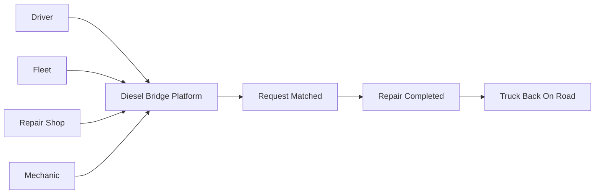

# Diesel Bridge Network
## Logo Concept + Animation Flow Spec (v0.1)

This draft defines a first-pass visual direction for the Diesel Bridge Network platform that connects:

- Truck drivers
- Fleet companies
- Repair shops
- Mechanics

The goal is to make "trusted operational flow" visible in both the logo and motion system.

## 1) Brand Intent

Core message:
`One connected bridge from breakdown to back-on-road.`

Design traits:

- Industrial but modern
- Reliable and urgent without looking chaotic
- Networked and collaborative (not single-sided)

## 2) Logo Concept: "Bridge Node"

### Symbol idea

The mark combines:

- A bridge arc (trust + structural reliability)
- A road center line (movement + uptime)
- Four outer nodes (the four primary actors)
- A central hub node (the platform orchestration layer)

### Mapping of nodes

- Top-left: Driver
- Top-right: Fleet
- Bottom-left: Repair Shop
- Bottom-right: Mechanic
- Center: Diesel Bridge platform

### Wordmark

- Primary text: `Diesel Bridge`
- Secondary text: `Network`
- Style: tall, engineered sans for the primary line, neutral sans for secondary

## 3) Color System (first pass)

- `Diesel Navy`: `#13233D` (trust, depth, infrastructure)
- `Signal Orange`: `#F97316` (urgency, action)
- `Steel Gray`: `#6B7280` (industrial context)
- `Road White`: `#F9FAFB` (contrast and clarity)
- `Hub Teal` (optional accent): `#0EA5A4` (coordination signal)

Usage ratio:

- 60% navy
- 25% white/light surfaces
- 10% steel gray
- 5% signal orange (high-emphasis only)

## 4) Basic Logo Rules

- Clear space: at least the diameter of one outer node on all sides
- Minimum digital height, icon only: `24px`
- Minimum digital height, horizontal lockup: `32px`
- One-color fallback: solid navy on light backgrounds, solid white on dark backgrounds
- Avoid gradients in core mark; reserve gradient usage for motion contexts only

## 5) Visual Flow Diagram (platform story)

## 6) Animation Flow Spec

### Motion principle

Every animation should communicate a single idea:
`Signal enters the network, the network routes it, the truck returns to service.`

### Hero animation timeline (10 seconds)

1. `0.0s - 1.2s`: Four outer nodes fade/scale in sequentially (clockwise).
2. `1.2s - 2.4s`: Bridge arc draws from left to right.
3. `2.4s - 3.2s`: Center hub appears with subtle pulse.
4. `3.2s - 5.0s`: Orange "service token" travels from Driver node to hub.
5. `5.0s - 6.8s`: Token splits into two candidate routes (Shop + Mechanic), then converges on selected route.
6. `6.8s - 8.2s`: Selected route locks with a bright stroke and confirmation ring.
7. `8.2s - 9.4s`: "Back on road" road-line animation sweeps forward.
8. `9.4s - 10.0s`: Full logo lockup settles with slight overshoot and hold.

### In-product motion patterns

1. Network pulse: Trigger on new job request; hub pulse expands once to connected eligible nodes; duration `700ms`.
2. Match confirmation: Trigger on mechanic acceptance; node ring closes clockwise with check reveal; duration `450ms`.
3. ETA progress: Trigger when dispatch is active; path stroke animates in short repeating segments; duration `1.2s` loop.
4. Completion: Trigger on job close; route line turns navy and token transforms to check badge; duration `500ms`.

### Motion tokens

- `duration-fast`: `120ms`
- `duration-base`: `240ms`
- `duration-emphasis`: `450ms`
- `duration-flow`: `700ms`
- `ease-standard`: `cubic-bezier(0.2, 0, 0, 1)`
- `ease-emphasis`: `cubic-bezier(0.22, 1, 0.36, 1)`
- `scale-enter`: `0.92 -> 1.00`
- `overshoot-enter`: `1.04 -> 1.00`

### Accessibility constraints

- Respect `prefers-reduced-motion: reduce`
- In reduced mode: swap path travel animations with opacity/state changes only
- Do not rely on color alone for status; pair color with icon/shape/state text

## 7) Deliverables Included In This Pass

- Spec document: `/Users/sergio/GitHub/TruckPitStop/docs/brand/DIESEL_BRIDGE_LOGO_ANIMATION_SPEC.md`
- Editable logo draft: `/Users/sergio/GitHub/TruckPitStop/docs/brand/diesel-bridge-logo-concept.svg`

## 8) Next Iteration Targets

1. Build 3 visual variants: industrial-heavy, route/map-heavy, minimal enterprise.
2. Validate at favicon size (`16px`, `24px`, `32px`).
3. Convert motion sequence to Lottie or CSS/Framer implementation spec for frontend handoff.
